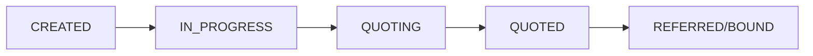
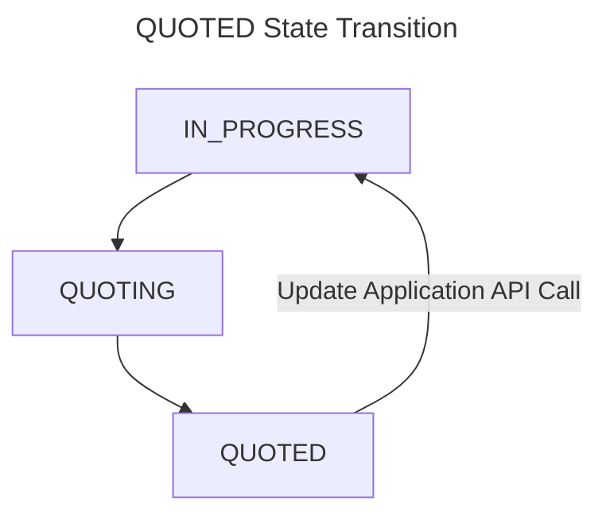
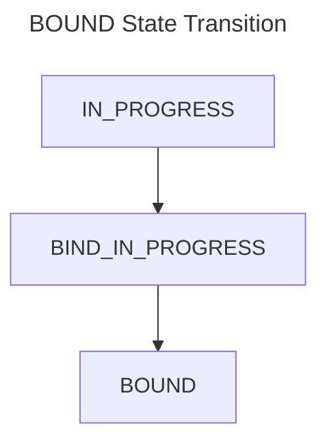

# Application
In the CoverForce realm, an application is the logical structure that enables any API integrator to store all the relevant information with respect to an insurance.

The application is also used to generate quotes, which is the insurance proposal from an insurance provider.
 
## 1. Industry Details
The insurance application captures specific industry details that contextualize the business's operations. This information helps insurance underwriters assess the unique risks associated with the industry and provide tailored coverage recommendations. Businesses can select their industry from a predefined list, ensuring accuracy and consistency in risk evaluation.

## 2. Employee Information and Job Code IDs
Incorporating employee information, along with job code IDs, enables businesses to correlate insurance data with their workforce structure. This feature proves particularly valuable in scenarios where certain risks or liabilities are tied to specific roles within the organization (Eg: Workers Compensation insurance). This information facilitates accurate risk assessment and helps determine appropriate coverage levels.

## 3. Locations
For businesses operating across multiple locations, the application allows seamless management of various addresses and geographical data. This feature assists insurers in evaluating location-specific risks, such as environmental factors or regional regulations.

## 4. Underwriting Question Answers
Storing responses to underwriting questions within the application not only expedites future policy applications but also ensures consistency in data submission. As businesses update their information over time, insurers can observe changes in risk profiles and offer relevant recommendations accordingly.

## 5. Past Policy Loss Information
The ability to input and access past policy loss information enhances transparency and enables insurers to analyze historical claims data. This historical perspective assists in refining coverage options, setting deductibles, and identifying patterns that may warrant risk management improvements.

## 6. Policy Type and Coverage Details
Businesses can select the type of insurance policy they require through the application. These policy selections are coupled with detailed coverage information, such as liability limits, deductibles, and endorsements. This data ensures that both businesses and insurers have a comprehensive understanding of the coverage in place.

## 7. Liability Limits
Storing liability limits within the application offers a clear overview of the financial protection each policy provides. This information is vital for risk management strategies, as businesses can evaluate if their liability limits align with potential losses

## 8. Application Status
The field `applicationStatus` in the [Application model](https://coverforce.stoplight.io/docs/coverforce-api/8b73ee7604e0b-application) gives a definitive statate for an Application. The following statuses are available, for an Application:
1. `CREATED` - When an Application is created using [Create Application endpoint](https://coverforce.stoplight.io/docs/coverforce-api/trnbv9v23fn2r-create-an-application), it will have this status. This denotes that the Application is created with minimal values.
2. `IN_PROGRESS` - Application is being updated, using the [Update Application endpoint](https://coverforce.stoplight.io/docs/coverforce-api/kiy8795nqj6ww-update-an-application).
3. `QUOTING` - Insurance Providers are being contacted for getting Quotations for the Application. This state will occur after the [Request for Quote endpoint](https://coverforce.stoplight.io/docs/coverforce-api/kv40kjes1o8dx-request-for-quote) is called.
4. `QUOTED` - This denotes that CoverForce has been able to generate Quotes for all the Insurance Providers in the Application.
5. `REFERRED` - Application is Referred with one of the Insurance Providers. This means, that post Quote generation, the [Refer Quote to Underwriter endpoint](https://coverforce.stoplight.io/docs/coverforce-api/8ywdmlgzx5a0h-refer-quote-to-underwriter) was called.
6. `BIND_IN_PROGRESS` - A Bind Request has been placed for the Application, using the [Request to Bind endpoint](https://coverforce.stoplight.io/docs/coverforce-api/dsn8xo4rcvz9j-request-bind-for-an-application).
7. `BOUND` -  One of the quotes is bound with the insurance provider. 
<!-- theme: info -->
> **Please Note:**  Applications in the states: `QUOTING`, `BIND_IN_PROGRESS`, `BOUND`, `REFERRED` are not allowed to be modified on the CoverForce Platform [through the Web Application, or the APIs].

Simple Application Status change flow:

**State transitions, in case of `QUOTED` and `BOUND` status:**

1. In case there are any Updates to the Application Data post a Quote is generated, we move the Application back in `IN_PROGRESS` state.
2. `BIND_IN_PROGRESS` and `QUOTING` are intermediary states in CoverForce Applications, and they automatically move to `BOUND` and `QUOTED` states respectively.
3. `BOUND` state is a final state for CF Applications, and no change in state happens post `BOUND`.

