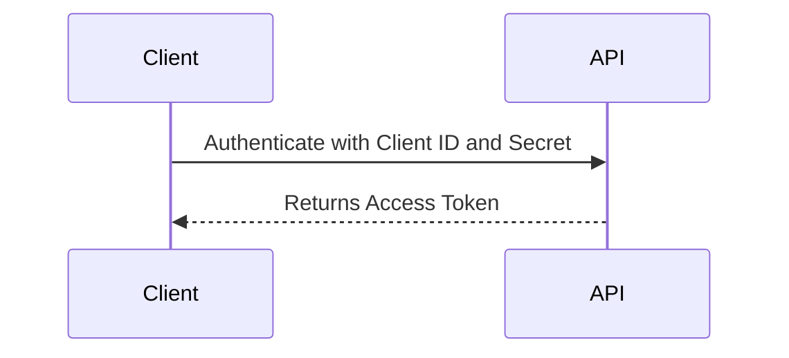
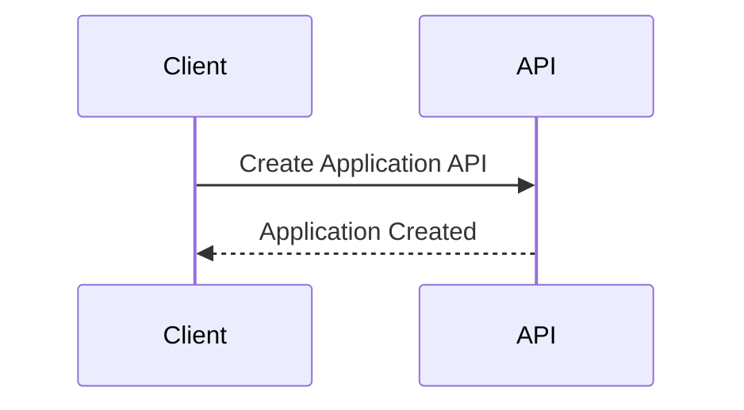
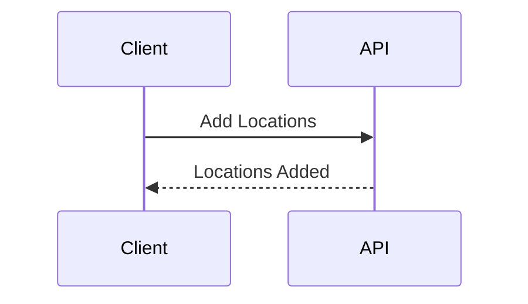
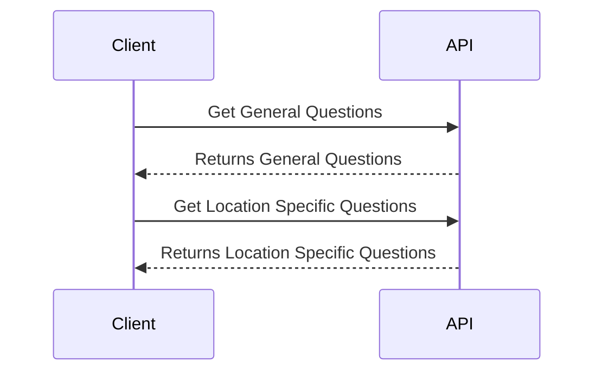
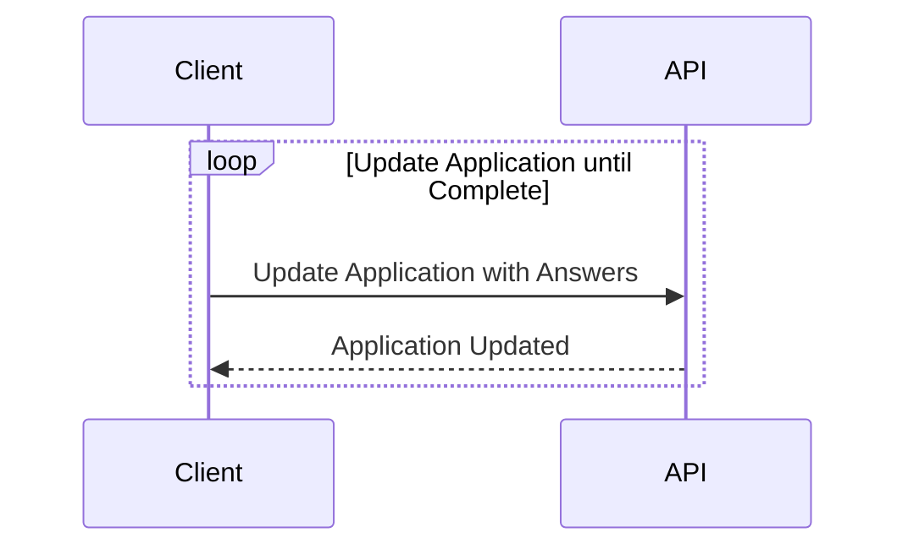
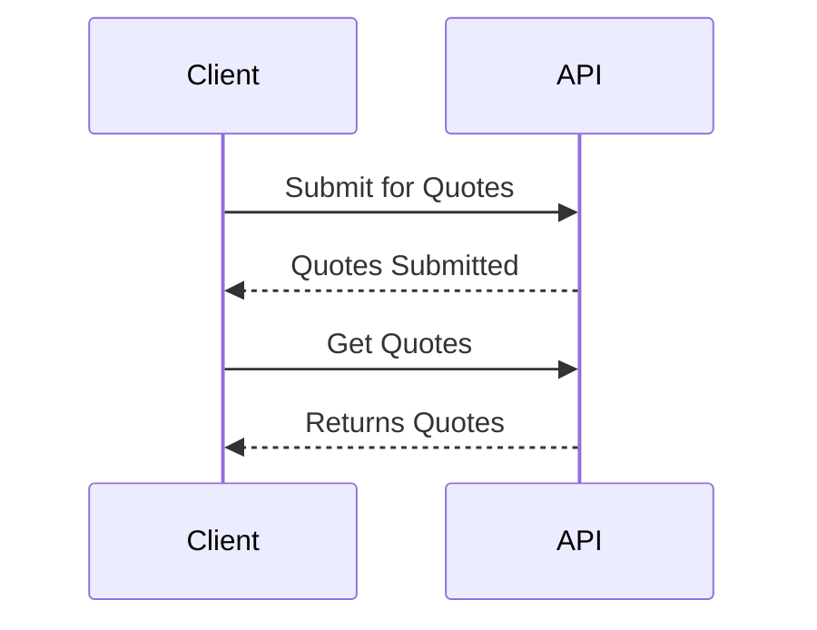
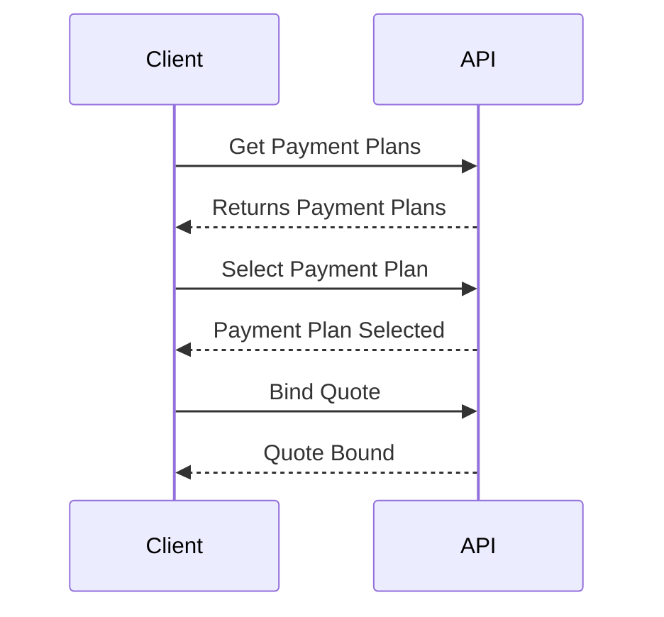

# User Journey
Streamlined B2B Insurance Application Process

## Step 1: Authentication
Begin by securely authenticating your identity to access our platform. Once verified, you'll receive a unique access token that ensures the confidentiality of your application data.

## Step 2: Creating the Application
Creating an application is a breeze. Provide us with the necessary information about your client, their business, and insurance requirements. Our user-friendly interface guides you through this step effortlessly.

## Step 3: Updating the Application
The flexibility is yours when it comes to updating the application. You have the freedom to perform the following tasks in any order that suits your preferences:

### 3.1 Location Management
Easily add, modify, or remove locations associated with your client's business. Our intuitive location management tool ensures accurate representation of their coverage needs.

### 3.2 Underwriting Questions

Fetch the underwriting questions applicable to the application and each location. Show these questions to your clients and update the Application with the answers entered by the user.

### 3.3 Iterative Application Refinement
Fine-tune the application until it's ready for submission. You can revisit and revise any aspect of the application, ensuring that all details are correct and up-to-date.

## Step 4: Submitting for Quotes
Once your application is primed, submit it to our platform to receive tailored insurance quotes. Our system efficiently matches your client's needs with appropriate coverage options from our network of trusted insurers.

## Step 5: Binding the Quote
Review the received quotes and select the one that best aligns with your client's requirements. Our experts are available to guide you through the decision-making process if needed. Once a quote is chosen, we seamlessly move to the binding stage.

